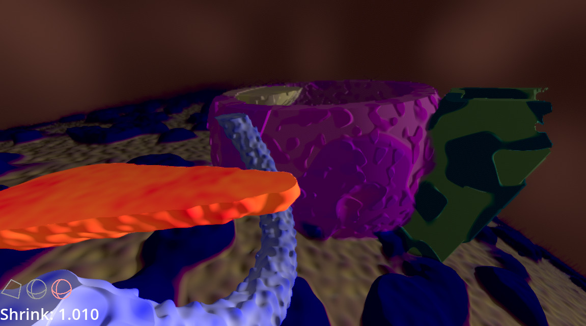

# RDT SDF Engine

Research Development and Testing of SDF Engine for [Corpusim](https://www.corpusim.com).

This is *not for production*. We are developing and proving out the graphics technology before it is integrated into the Corpusim project.

## Features

**Shrink** down into geometry built by Signed Distance Functions (SDFs). 

Place **Cutaways** into the SDF geometry to get cutaway (cross-sectional) views. Cutaways have been central to Anatomy & Physiology study since the dawn of dissection!

## Controls

### 6 Degrees of Freedom (6DOF) Probe / Player

--

<kbd>W</kbd><kbd>A</kbd><kbd>S</kbd><kbd>D</kbd> : Forward, Strafe Left, Backward, Strafe Right

<kbd>Space</kbd><kbd>Shift</kbd> : Strafe Up, Strafe Down

<kbd>Q</kbd><kbd>E</kbd> : Roll Left, Roll Right

Mouse Movement : Look (Yaw & Pitch)

Mouse Wheel : **Shrink** 

<kbd>Caps Lock</kbd> or <kbd>Ctrl</kbd> : Toggle between Fast and Slow Movement

--

Left Mouse Button : Place a **Cutaway**

Right Mouse Button : Clear all **Cutaways** previously placed

<kbd>C</kbd> : Toggle between box and sphere-shaped **Cutaway**

--

<kbd>Esc</kbd> : Return control of Mouse Cursor. Useful to go fullscreen or exit program.

## How to Run

To use the software, download it from [Releases](https://github.com/Corpusim/Corpusim_RDT_SDF_Engine/releases)

To work on the software itself in the Godot Editor, you must be running Godot v4.0 beta1.